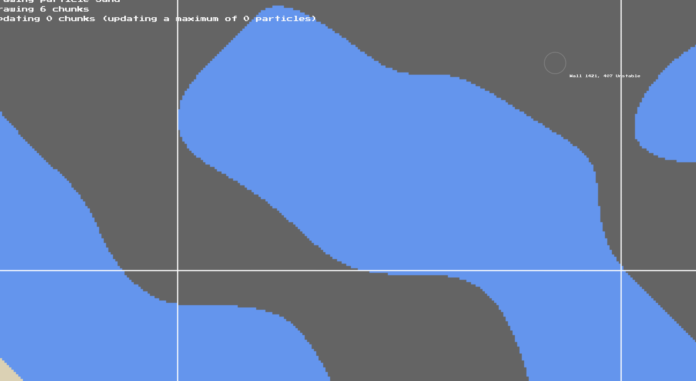
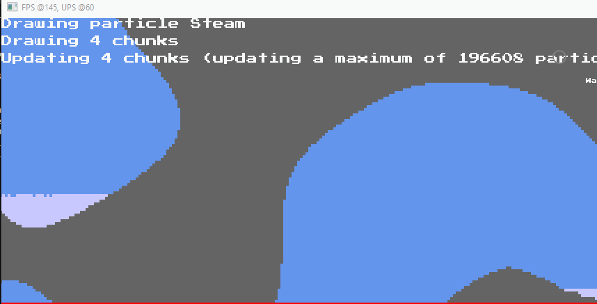
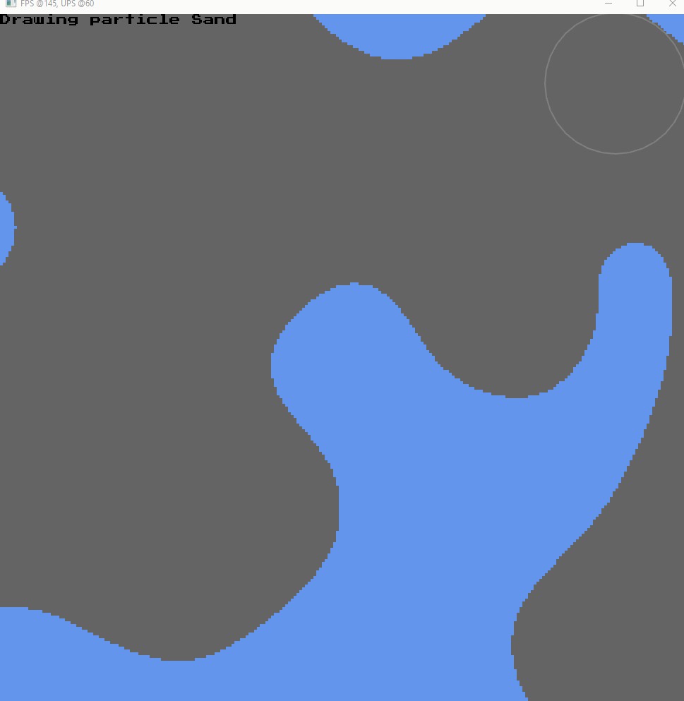

These are some miscellaneous solo projects I made throughout the years. None of these are really 'full' games, but mostly just test projects meant for me to practice certain skills, such as certin design patterns or different software architectures (ECS, etc).

# BoidsECS

BoidsECS is a recent project (this year) I made to go back and practice ECS architecture in the Rust programming language. For this, I chose the Bevy ECS game engine since I had used it before and it seems to be the most popular choice when it comes to ECS libraries/game engines for Rust.

I wanted to be able to simulate as many boids as possible, with the main goal being 10k at 100+ FPS and the stretch goal being 100k at 60FPS or higher. I first created a spatial hash resource (resources are used in Bevy to define globally unique data) that would be used to divide the world into discrete cells that Boids could use to grab their neighbours. This avoided having every boid iterate over every other boid. This spatial hash was a sparse implementation, meaning that cells were only created when needed allowing for me to have arbitrary sized worlds. For extra performance, I was able to have every boid grab their neigbours in parallel using the parallel iterator (par_iter) provided in the Bevy API. I also found that the size of the cells in spatial hash affected performance and ended up settling with a size of 35.

I was also able to parallelize other systems in the simulation using the parallel iterator, such as the system that updated all the boids' transforms. For this project, I also heavily utilized profiling tools such as Tracey to find and fix bottle necks in my code.

In the end, I was able to reach the main goal of 10k boids at >100FPS (usually locked to 144FPS if I wasn't recording or doing any CPU intensive task in the background), though I'm still trying to figure out how to get to 100k boids since my bottleneck at 100k boids was rendering.

Video showing a simulation of 10k boids at >100FPS(ctrl+click to open in a new tab)

# Falling Sand

I've loved falling sand games ever since playing "Powder Game" on dan-ball.jp. Since then, I've made a few of my own falling sand simulations in various different languages, from Lua to Rust (it has sort of become the go-to project I make when learning a new programming language). However, one that I made in a relatively new programming language, called Beef, stands out as the one I'm most proud of even if I never got around to actually finishing it.

This one was specifically inspired by Noita, a "rogue-lite" game where you play a wizard and make wands from different spells you can find around the world, with the falling sand simulation being at the forefront of the games mechanics. One of the things that impressed me (and something I had not yet seen in a falling sand simulation) was it's massive scale and the amount it was able to simulate. I used the dev's GDC talk as a reference for how they were able to do it (how they implemented multithreading in the simulation, etc).

Below are a collection of gifs (not necessarily in chronological order)

A showcase of the 'dirty rect' optimization I implemented. This was talked about in the Noita GDC and essentially what this optimization does is define a 'minimum bounding box'of all the particles in a chunk. Then, in the update loop of that chunk, it would only iterate over the indexes inside the area of the dirty rect, cutting down the amount of iterations done per frame.

It's also worth mentioning that the grey terrain seen in the gif is randomly generated.

A showcase of particle behaviours. Here, steam condenses back into water after a certain amount of time. This is a 'hardcoded' behaviour and there was no sort of 'temperature' simulation happening.

A showcase of different particle types. The black particles in this is supposed to be oil but the behaviours hadn't been defined/implemented yet so they just stayed in place like a solid object.

A showcase of simple world generation (the sand was created via a perlin noise function)