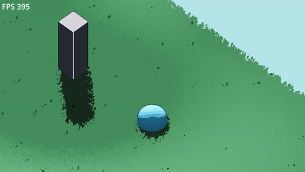

This project was a continuation of the slime game I was working on in Unity. As mentioned on the post about that game, I had moved from Unity to Godot due to controversies (such as the Unity Runtime Fee). I chose Godot over Unreal Engine due to it's simplicity and because of how light-weight it was. I found it somewhat difficult to replicate the same artstyle that I had in Unity in Godot, mostly due to the lack of similar projects and nothing similar to Unity's scriptable renderpipeline in Godot. I ended up coming across a user named ["denovodavid" on reddit](https://www.reddit.com/user/denovodavid) who was also trying to do 3D pixel art in Godot based off of t3ssel8r's work.

In terms of remaking the character controller, I found it pretty simple to do and ended up feeling that it was overall a lot better feeling in Godot than it ever was in Unity. For example, in Unity the jumping was harsh and snappy while in Godot it was smooth and floaty which matched well with the character. I was also able to implement various features that didn't exist in the Unity version such as coyote time (a short period where the player can jump after falling off of a ledge, etc). I liked GDScript's simplicity and quick iteration times over C# in Unity (though you can use C# in Godot, I chose not to.)

One somewhat big upgrade over the Unity version was rendering large amounts of grass. Universal Renderpipeline was in a weird spot when it came to instancing during my time with it, and stuf like DrawMeshInstanced/DrawMeshInstancedIndirect weren't really working. In Godot, however, it was really simple to get something working. I ended up using the [scatter plugin](https://github.com/HungryProton/scatter) to generate large fields of grass.

Here's a look at an early rendition of how the grass looked in-game

One notable thing about the grass is that it being shadowed is 'binary', meaning it can only ever be shadowed or not shadowed (grass can't be 50% in shadow and 50% not in shadow, etc) which leads to a more stylized and aesthetically pleasing look. This had to be achieved by modifying Godot's source code, however. By going into the source code for the shader language and removing the const indentifier for VERTEX for Godot fragmenet shaders, VERTEX can be manipulated in the fragment shader without visually altering the mesh. By placing all vertices at the mesh origin in the fragment shader, the grass will always either be not shadowed or completely shadowed.

Here's a look at the final iteration of the grass

A notable part about this iteration is the cloud shadows moving over the grass. Godot doesn't have any support for masks on direction lights (called 'light cookies' in Unity) so I had to get creative. I ended up making an overlay shader that created noise in world space and slowly panned it in a direction. This shader could then be applied as the next pass in any material that needed to have cloud shadows. This allowed for seamless cloud shadows on all objects that needed them (player, grass, obstacles, etc)

At the end of it, I found Godot was nice to use albeit somewhat frustrating. It didn't have a lot of features I came to rely on in Unity (light cookies, scriptable renderpipeline, first-class terrain support, etc) and some stuff required me to modify the source code of the engine and recompile. 
