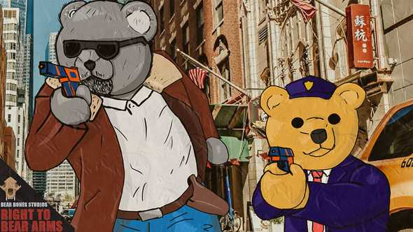
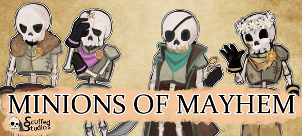

Throughout my 3 years at Falmouth University, I worked on 3 main game projects that we made in a team (1 per year), as-well as a smaller (usually solo) projects for other modules I was in (COMP). This post will detail all the ones I think are most noteworthy. All of these games were made in Unity3D unless I specify otherwise.

# Right to bear arms

This was the first year game I made with a team of around 8 people. I believe we had 3 programmers (me included), 2 designers, 1 animator, 1 audio guy, 1 writer, 1 modeller, and 1 writer. This is probably the most unfinished out of the 3 games, mostly due to the fact this was everyones first time making a game with a team, the COVID-19 pandemic starting at the same time as we started development, and around half the team dropping out of University or otherwise being unavailable.

The game was supposed to be a crime-drama fighting game with the characters composing of stuffed teddy bears (hence the name). We originally intended to have atleast one complete level in the demo but due to the reasons mentioned above, we were never able to finish this level.

However, we were able to get a somewhat playable demo finished, albeit with a lot less scope than we initially intended. The demo consists of the player inside an office building (I believe this was supposed to be a part of the game where the player is attacked at a police station) with a few enemies for you to defeat.

Throughout most development I worked on a dynamic parkour system that would allow the player to climb walls, vault over obstacles, etc. Though, due to the aforementioned problems with development, this was never fully used. In the demo, only jumping and other basic movement was enabled.

# Red pluto

This was the second year game and the one I’m most happy with in terms of the demo we produced. It’s a survival game set on Pluto in the distant future where the sun has started to develop into a red giant and has swallowed Earth. The gameplay consists of you collecting resources for crafting, etc. It has a focus on survival more than PvE combat. While there is an enemy in the game, it cannot be fought and instead you are expected to avoid it. A lot of the aspects of the game were inspired by Subnautica.

The demo itself consists of the first few quests of the game, leading up to you crafting the spider mech, a procedurally animated vehicle providing your main means of transport around the planet. The map itself is pretty large and consists of multiple biomes where you can find different resources, as-well as a biome inhabited by the aforementioned enemy.

It was made with Unity HDRP although the final performance of the game leaves a lot to be desired but I feel it’s still very playable. Throughout development I mostly worked on various gameplay systems such as an event manager to allow the other programmers to easily tie together systems by listening for events. I also worked on the spider mech and provided very basic models for the game.

Overall, apart from the performance issues, I feel this was a pretty complete and good looking game with fleshed out mechanics (for a demo).

# Minions of Mayhem

This was the third and final game I made with a team during my time at University. It is the one I’m most happy with in terms of the quality of code I wrote. It’s a local co-op beat-em-up with roguelike inspirations like Binding of Issac. It’s 2D with a hand-drawn artstyle meant to be reminiscent of a childrens story book. The story revolves around two brothers fighting over a kingdom. The gameplay consists of you of having to clear rooms and collect loot (different rooms give you different loot for entering, shown by an icon above the door).

The demo consists of everything leading up to the first boss fight as-well as an intro to provide to the players the basic out line of the story, complete with some voice over provided by one of our programmers.

For this game, I wrote a pairing system meant to pair controllers with players using unity’s New Input System. When a new peripheral (keyboard, controller, etc) is connected or an existing one is interacted with (pressing a button, etc), it creates a new DeviceData class containing the InputUser, the InputActionAsset (containing the keybindings) and the InputProvider (a chain-of-responsibility system). These are stored in a dictionary of key, value pair int, DeviceData where the int is the device ID and DeviceData is the newly created DeviceData class. It also handled disconnection of devices (leading to that device and device data being removed from the dictionary, as-well as cleanly destroying the assigned player if they exist and the game has already started).

I also created a bootstrap sytem that made sure that everything was initialized correctly when a scene was loaded. This allowed other developers to easily test any scene without having to go through a prerequisite scene (i.e. main menu) to make sure everything got initialized properly. I also reused the event manager from the previous game as-well as a node-based dialogue system from my solo game project Red Grove Academy. I tried to make sure my code stayed clean and tried to program in way that avoided spaghetti code by using design patterns like observer, chain of responsibility, singletons, etc.

Overall, this one felt like a complete demo. It has a interesting artstyle, good-feeling combat, and good gameplay.

# EcoBoids

 A gif of the game with debug info turned on to show the spatial hash used for optimization.

EcoBoids was a solo project I made for my COMP250 module (Individual Specialist Computing Project: Artifical Intellignece). It was a small ‘sandbox’ filled with a bunch of Boids that followed the traditional boid flocking behaviour. I also added a bunch of other stuff to make it a more of a simulated ecosystem (hence the name of the project). Boids would reproduce and get hunted by predators, as-well as have random stats that would influence a value that determined how suitable they were for mating (faster speed = can outrun predators = can produce offspring with those traits).

I was hoping that it would create an emergent ecosystem that would fall into an equilibrium where the boids would reproduce at the same rate as they were being hunted and killed by predator boids. However, I was never able to fine tune the simulation to get to a point like this and mostly what happened was the predator boids would always eventually wipe out all the prey.

A lot of my work on this game was done to make it performant with a lot of boids. I didn’t use Unity and C# for this project, and instead used a relatively new programming language called Beef that was a language based off of C# but allowed for better performance due to the lack of a garbage collector and the inclusion of manual memory management. The project also helped me learn how to program in a more low-level environment, having to make sure memory was freed when it was no longer being used, etc. I made a sparse spatial hashing system for the game that allowed it to run 1000s of boids at and above 60FPS. The spatial hash made sure that boids would only check boids in surrounding cells to calculate the various behaviours for the flocking algorithm (adhesion, cohesion, and separation).

I enjoyed this project a lot as I never worked much with Artificial Intellignece before this, and as aforementioned it also helped me learn more about low-level programming. I ended up getting a 75.2 mark on this module.