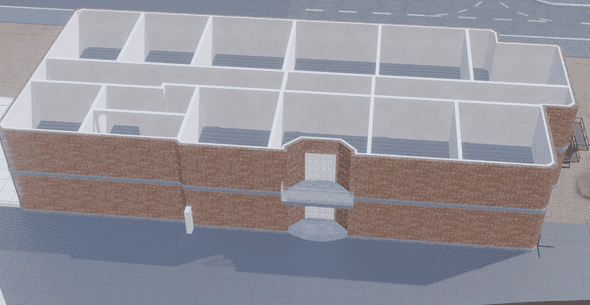
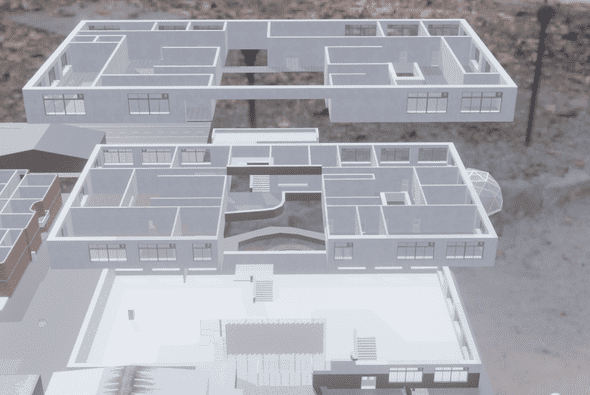
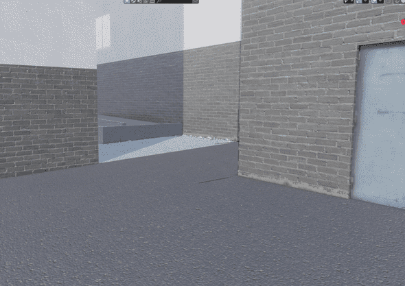

Red Grove Academy was my first actual attempt at a solo game project in Unity. It was to be an adventure game set in a boarding school with the story revolving around a mystery within the school. I first started it in 2018 during my time at Southampton City College doing the Game Design course.

The game went through many revisions. From complete overhauls, to different school designs, to different character designs, to different story ideas, e.t.c. The game also evolved as I did as a developer. As I became more competent as a programmer, understood how to properly utilize design patterns like observer, singleton, chain-of-responsibility, the game got these incorporated into it’s codebase to create a pretty modular codebase that I still use parts of in other projects today (such as a custom game event manager).

Unfortunately, as I spent more time in this project, the more it became obvious to me I didn’t have the skills as a solo developer to pull it off. While the programming side of the game (gameplay systems, etc) was pretty much set in concrete and complete, I still had to:

* Do character design and animation
* Finish the school design
* Create up to 50+ unique characters to spread across the map of the school to make it not feel empty (most being background characters)
* Flesh out and create a proper story to the game
* Marketing

I realized that I didn't have enough experience or skills to get this game to market and as a result I stopped development around 2021.

Below is a bunch of screenshots I created of the game during it’s development (not in chronological order) as-well as a description of what they show. Also worth noting that this is only a showcase of the latest 'evolution' of the game. It went through about 5 total redesigns before this (however screenshots and footage of this is lost to time, unfortunately)

A view of the dormitory building without it's roof, showing the layout of the building.

A view of the main school building. The floors have been separated vertically to show the layout of each one.

An on-the-ground view of an alley that separates the main school building and the gym building.

An animated gif showing the player riding a bike around on the field next to the school. The bike was supposed to be a faster mode of transport. You can also see that the player has IK to keep the feet attached to the peddles and to keep the hands on the handle bars.

An animated gif showing the player talking to an NPC, showcasing the dialogue system which used a custom node-based workflow internally

An animated gif showing a small cutscene of the player using a vending machine. It was made using a chain-of-responsibility system to take away control from the player and have them move to the vending and then playing an animation of picking up a can and drinking.

